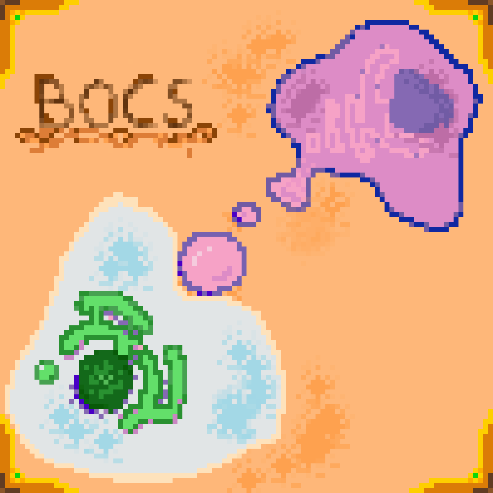

# 📦 bocs: 

## A 3D Mesoscopic Cell Simulation Engine in Rust

***bocs*** is a low-level 3D simulation engine for modelling biological systems at the mesoscopic scale — with a specific focus on **membrane physics and lipid self-assembly**. Built entirely in **Rust**, it aims to balance **scientific realism**, **performance**, and **transparency** by avoiding game engines and prebuilt abstractions.

I'm building a tool for exploring emergent behaviour in soft matter systems.

## Current Status: See plan updates [here](./docs/Current%20Plan.md)  
> [!NOTE]
> This is an early-stage, work-in-progress project. I'm building everything from scratch — the rendering pipeline, the simulation logic, and the core data structures — which means progress is steady but intentional.   
> Currently, the app should be ran on one monitor only (no switching). This is due to a lack of perceived clarity and consistency across platforms using winit's dpi crate. See [here](../../docs/lights%20camera%20action/The%20Near%20Plane.md) for notes on my implementation of a camera frustum and why the aspect ratio of the window is integral to the app's functionality. I plan to address DPI-awareness in future updates.

Expect:

* A custom GPU-accelerated rendering pipeline
* Voxel-based scalar field representation of lipid concentration
* Physically grounded camera orbit system and frustum-based ray generation
* Ray marching renderer with per-frame scalar updates
* Focus on approximating real cell membrane behaviour (e.g. vesicle nucleation, protein-coupled membrane deformation)

## Why?

The field of computational biology is undergoing a revolution. With breakthroughs like [AlphaFold](https://alphafold.ebi.ac.uk/) showing the power of machine learning in structural prediction, the horizon has shifted. What else might we simulate? Can we push into domains where wet-lab work is expensive or inaccessible?

**I believe the answer is yes.**

I'm particularly interested in questions like:

* How does membrane curvature arise from local lipid composition or protein activity?
* What kinds of cell-like behaviours can emerge from purely physical rules?
* How can we develop a fully integrated cellular model — from genome to phenotype — that exhibits real, *in-vivo* behaviour?
* Can such a model be used in conjunction with wet-lab experimentation to accelerate research?

Ultimately, I'd love to explore the design of **synthetic cells** through *in-silico* modelling. I learn best by studying theory and validating through programmatic implementation, so I am developing my own simulation engine.

## My Background

* BSc (First Class) in Biological Sciences, Durham University
* Fluent in low-level systems programming (C++, Rust), with a focus on performance optimisation
* Familiar with mathematical and physical modelling
* An inter-disciplinary fascination with biology, mathematics, computer science, and physics

This project blends biophysics and computation. I want to see how far I can push *in-silico* cellular modelling using compute shaders and optimisation techniques.

## Guiding Principles

* **Learn by doing**: No black boxes. I avoid engines like Bevy so I can own every layer of the stack.
* **Performance**: Rust gives me memory safety without sacrificing speed. I use `wgpu` directly for graphics.
* **Fidelity**: Design choices are guided by the physics of lipid behaviour, diffusion, and self-assembly.

## Why the name "bocs"?

It means "box" in Welsh — a nod to voxel grids, cellular compartments, and the 3D simulation space I'm building. It conveniently stands for:

> **B**iological
>
> **O**bjects
>
>     in
>
> **C**omputational
>
> **S**pace

## Get Involved

I'm always open to feedback, collaboration, or discussion with other simulation-minded biologists, programmers, or designers. Please reach out!
