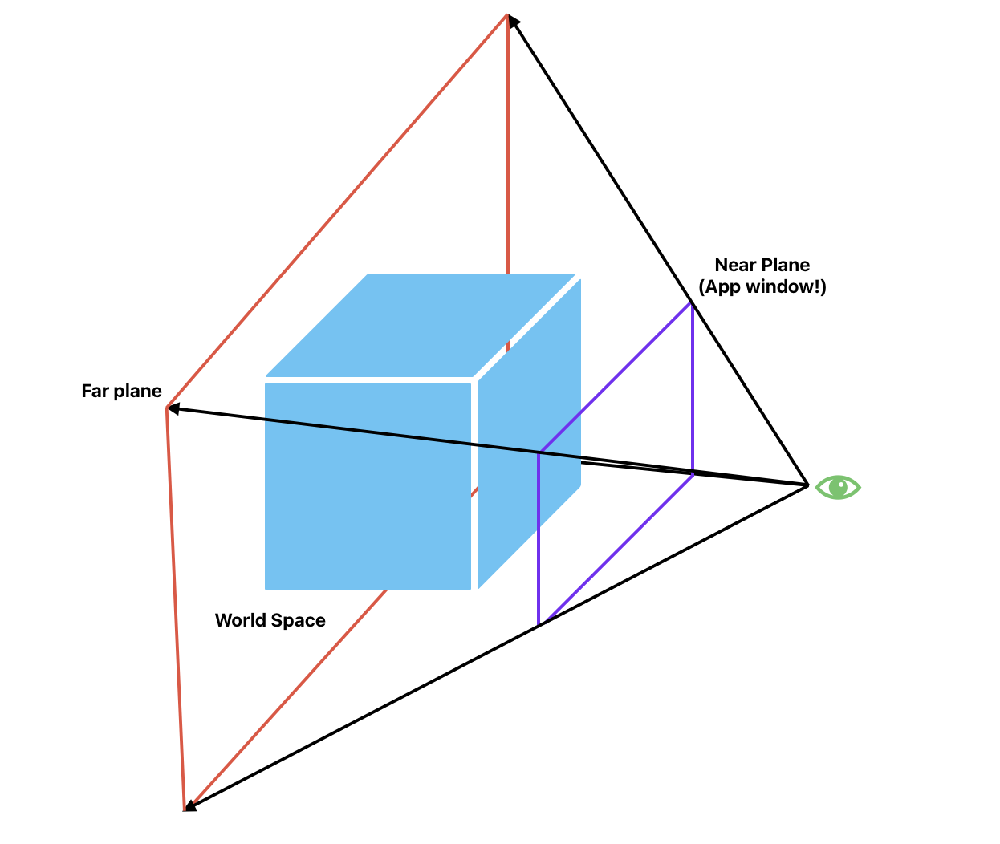
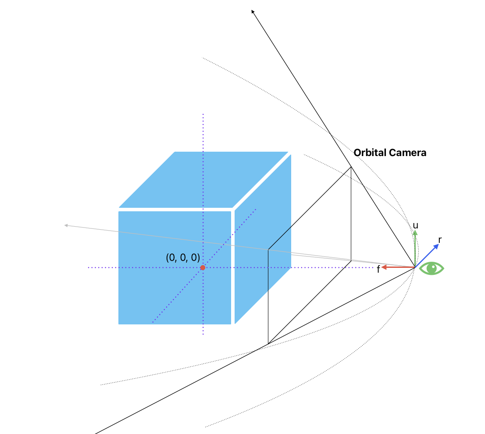
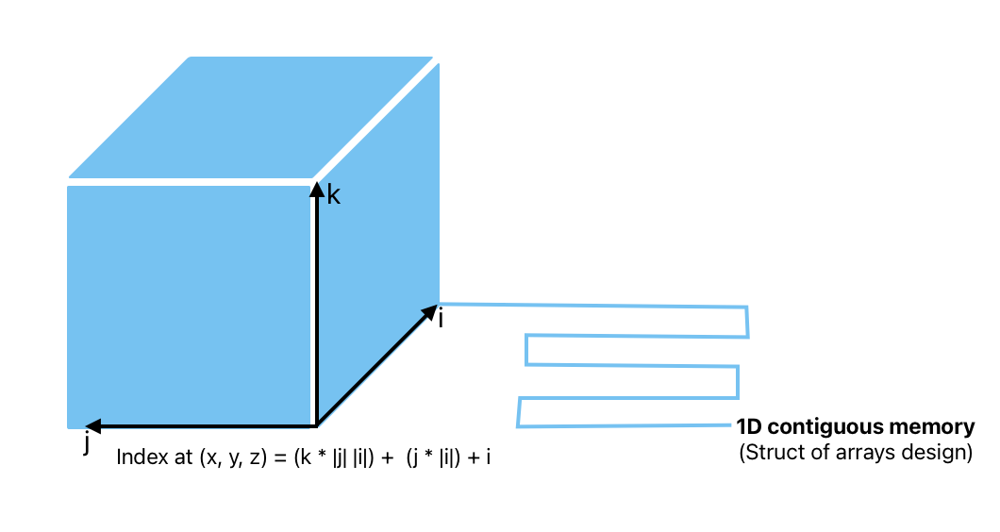
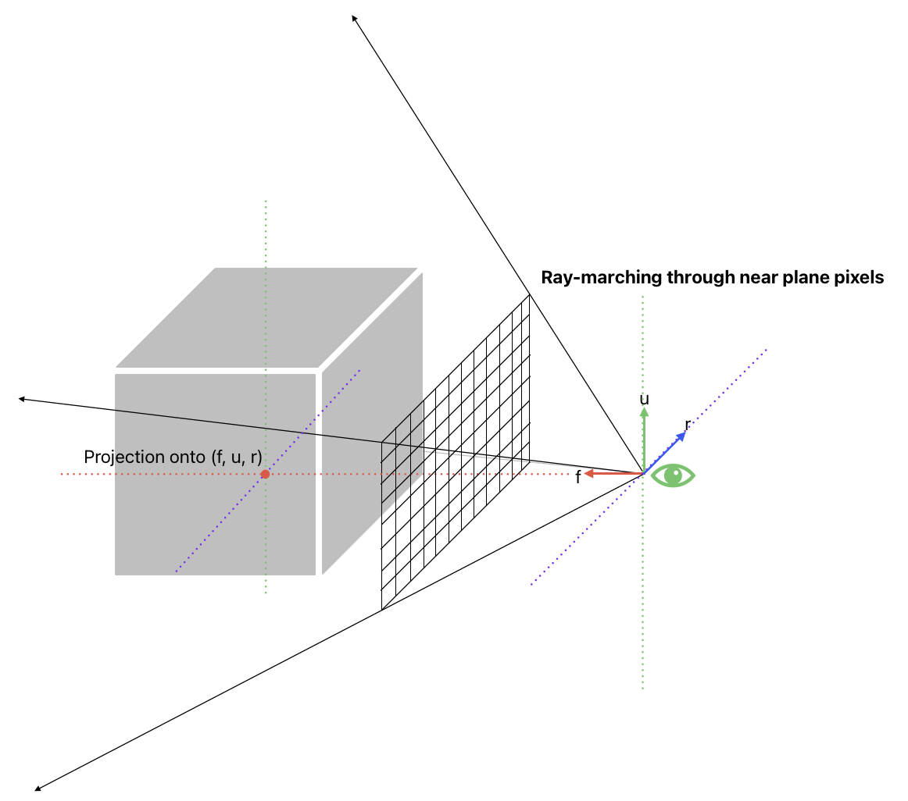
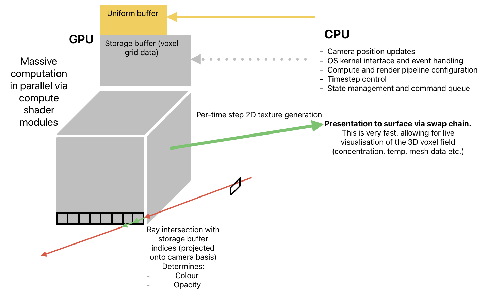

# Setting the Scene  
I wanted to visually represent the app's design choices. These are abstract, high-level diagrams that should give some insight into the engine's functionality.  

### App window *as* the Near Plane  
The window is the literal intersecting plane into the simulation space.  
* Focal distance from camera to centre is height/2 * tan(90) = height/2.  
* Horizontal scaling that preserves 90 degree vertical viewing angle is (width/2) / (height/2).  

### Orbital Camera  

### Voxel Grid as Flat, Contiguous Memory

### Raymarching through Near Plane Pixel Grid

### Engine Architecture Overview

